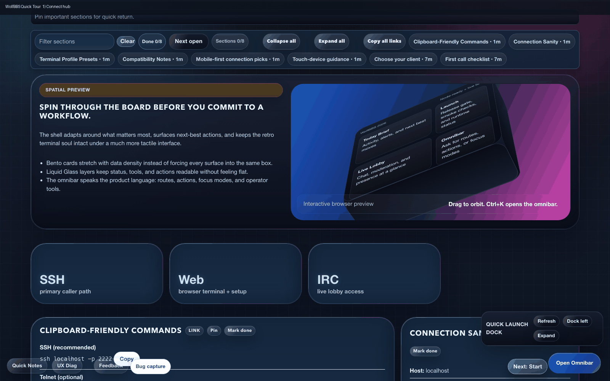
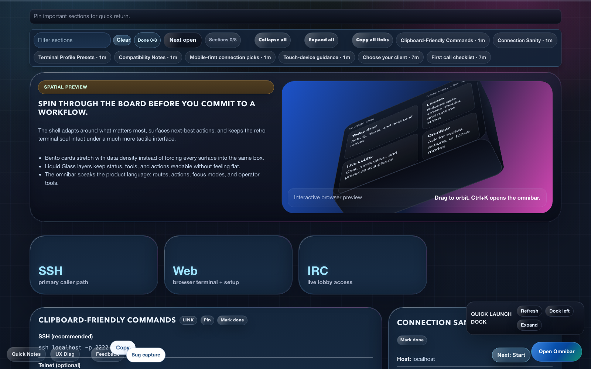
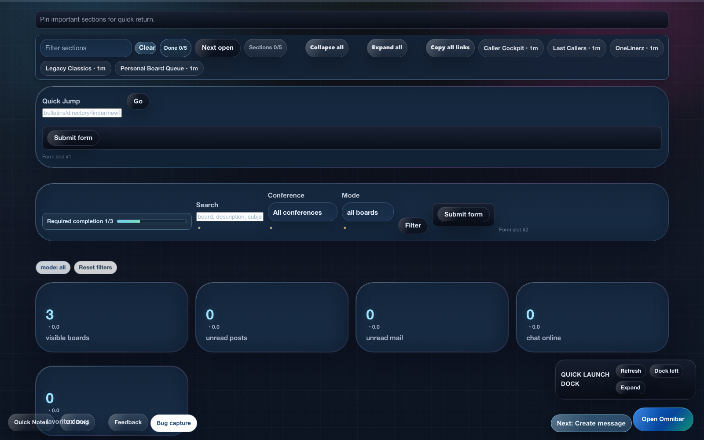
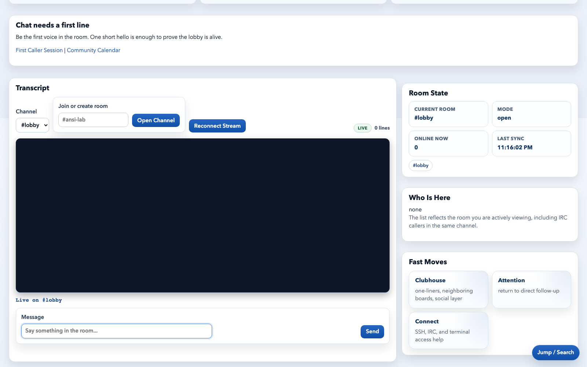
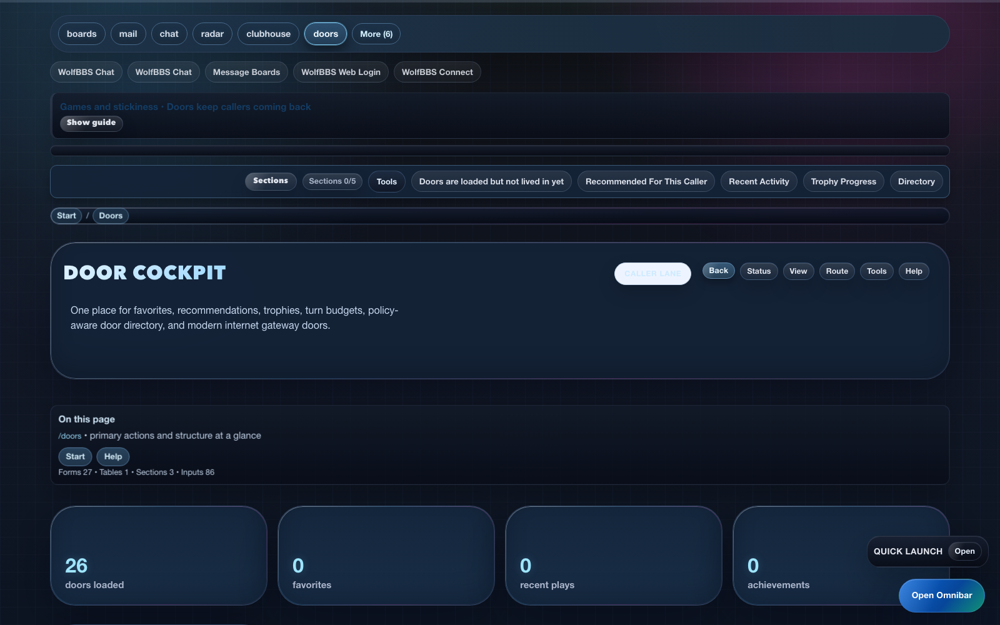
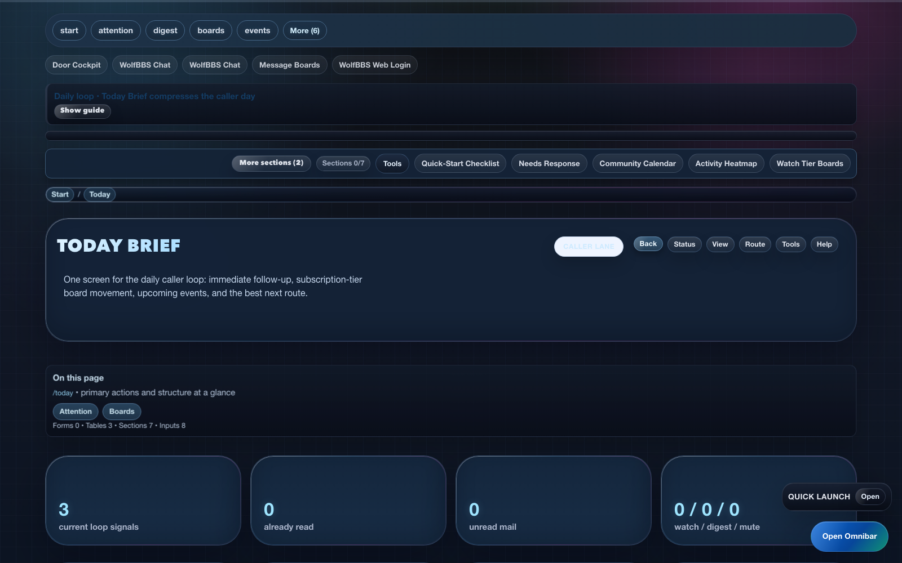
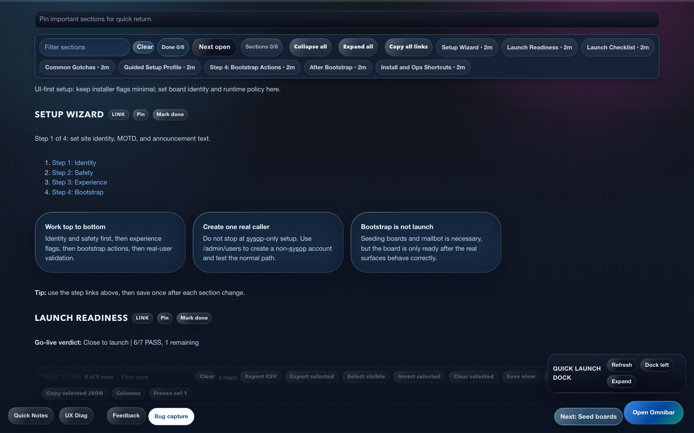
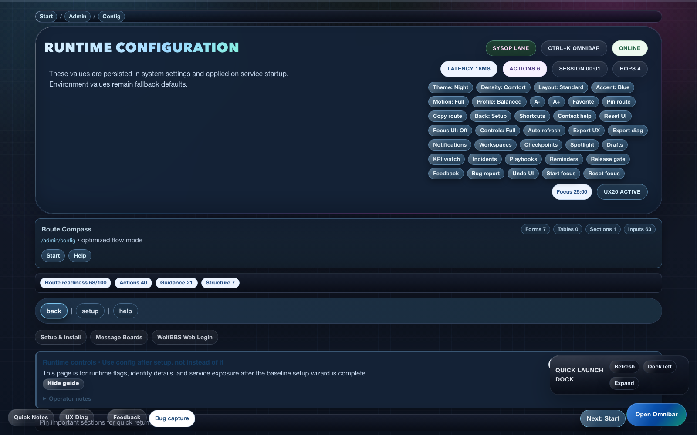
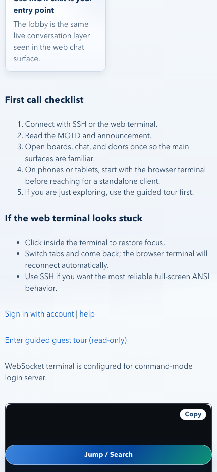

# WolfBBS

WolfBBS is a self-hosted, SSH-first bulletin board system with a Wildcat-style ANSI experience, modern web companion, IRC bridge, doors, file areas, and turnkey installation.

The canonical public repo is [Awassee/wolfbbs](https://github.com/Awassee/wolfbbs).

[](https://github.com/Awassee/wolfbbs/releases)
[](https://github.com/Awassee/wolfbbs/actions/workflows/install-check.yml)
[](https://github.com/Awassee/wolfbbs/actions/workflows/integration-smoke.yml)
[](LICENSE)
[](https://github.com/Awassee/wolfbbs/stargazers)

WolfBBS gives you classic BBS texture with a modern operator control plane and turnkey install/upgrade workflows.

Quick links:
- [Install now](#quick-install-linux)
- [Release v2.1.1 notes](docs/releases/v2.1.1.md)
- [Screenshot showcase](docs/SHOWCASE.md)
- [Feature datasheet](docs/DATASHEET.md)
- [First 30 minutes as sysop](docs/FIRST_30_MINUTES.md)
- [Running a community](docs/RUNNING_A_COMMUNITY.md)
- [Documentation hub](docs/README.md)
- [Open source and licensing](docs/OPEN_SOURCE.md)
- [Security policy](SECURITY.md)
- [Contributing](CONTRIBUTING.md)
- [Releases](https://github.com/Awassee/wolfbbs/releases)



## Current Release Status

WolfBBS is currently shipped as `v2.1.1` with:

- clean package generation via `scripts/package-dist.sh --clean --version v2.1.1`
- checksum + manifest output per bundle under `dist/v2.1.1/`
- full acceptance validation (`go test`, verifier fast/smoke, automated manual acceptance)
- one-command readiness validation via `scripts/feature-complete.sh`
- a simplified web shell with grouped status/tools menus, compact legacy nav rails, and lower-noise dense pages
- refreshed screenshots and public docs that match the shipped UI
- updated GitHub-facing product pages (`README`, `docs/SHOWCASE.md`, `docs/DATASHEET.md`, `docs/PRODUCT_GUIDE.md`)

## Product Snapshot

| Lane | Primary surfaces | Why this lane exists |
| --- | --- | --- |
| Caller | SSH ANSI, `/today`, `/boards`, `/chat`, `/doors` | keeps daily interaction fast, social, and game-friendly |
| Sysop | `/admin/setup`, `/admin/launch`, `/admin/config`, `/admin/ops` | gives operators a direct launch and maintenance control plane |
| Community | `/events`, `/challenges`, `/clubhouse`, IRC bridge | creates repeat visit loops and shared momentum |
| Distribution | `bootstrap.sh`, `install.sh`, release tarballs | supports quick install, upgrade, repair, and uninstall lifecycle |

## Start In 3 Minutes

1. Paste one command (Linux): `curl -fsSL https://raw.githubusercontent.com/Awassee/wolfbbs/main/bootstrap.sh | bash`
2. Sign in to `/admin/setup` using the bootstrap sysop from installer output.
3. Validate caller surfaces in this order: SSH, `/boards`, `/chat`, `/doors`, `/scores`.

## Why WolfBBS

WolfBBS is built for operators who want the feel of a classic board without the usual setup pain.

- `Retro caller experience`: ANSI/TUI menus, message boards, private mail, doors, newscan, and classic operator views.
- `Modern access layer`: web companion, admin console, live chat, IRC bridge, password reset, health checks, and packaging.
- `Low-friction operations`: paste-and-run bootstrap, guided installer menu, upgrade and repair commands, Docker-first deployment.
- `Community-ready`: callers, moderators, sysops, guest tours, directory, bulletins, one-liners, scores, and public-facing discovery surfaces.

## What You Get

| Capability | What it does | Why it matters |
| --- | --- | --- |
| ANSI BBS | SSH-first caller experience with message boards, files, chat, doors, newscan, and classic menus | Delivers the nostalgic interaction model people actually want |
| Web companion | Browser-based boards, mail, chat, admin, setup, status, and discovery routes | Makes the board usable for modern users and operators |
| IRC bridge | Shared channel state between web chat and IRC clients | Lets existing IRC users join the same community without a custom client |
| Sysop control center | Setup wizard, config center, audit views, diagnostics, and door/file/chat administration | Reduces day-two operational burden |
| File base and doors | Uploads, indexing, queue management, scores, trophies, and integrated games | Gives the board depth beyond message threads |
| Packaging and lifecycle | Bootstrap installer, release tarballs, repair, doctor, upgrade, uninstall | Makes the product practical to deploy and maintain |

## Datasheet Highlights

| Highlight area | Core features | What this gives you |
| --- | --- | --- |
| Terminal-first caller UX | ANSI menus, message boards, private mail, doors, score surfaces | classic BBS feel with modern reliability |
| Multi-surface access | SSH + web companion + IRC bridge | one community layer across different clients |
| Sysop operations | setup wizard, launch center, config, audits, diagnostics | lower friction on day one and day two |
| Release and lifecycle | bootstrap installer, package artifacts, upgrade/repair/uninstall commands | practical deployment path for non-developer operators |

Full product datasheet: [docs/DATASHEET.md](docs/DATASHEET.md)

## Best Fit

WolfBBS is a good fit if you want to:

- host a hobbyist retro board with modern onboarding
- run an internal community hub with SSH, web, and IRC access
- launch a retro-gaming or door-game focused community
- experiment with BBS-style interaction without building a stack from scratch

## Quick install (Linux)

```bash
curl -fsSL https://raw.githubusercontent.com/Awassee/wolfbbs/main/bootstrap.sh | bash
```

This path does not require `git` to be installed first.

## Quick install (macOS)

```bash
curl -fsSL https://raw.githubusercontent.com/Awassee/wolfbbs/main/bootstrap.sh | bash -s -- --install-brew
```

This path also works without a preinstalled `git` client.

## Screenshot Gallery

<table>
  <tr>
    <td width="50%">
      <a href="docs/assets/screenshots/connect.png"></a><br>
      <strong>Connect Hub</strong><br>
      <sub>SSH, web terminal, and IRC onboarding from one screen.</sub>
    </td>
    <td width="50%">
      <a href="docs/assets/screenshots/boards.png"></a><br>
      <strong>Message Boards</strong><br>
      <sub>Threaded discussion, filtering, and caller-focused board flow.</sub>
    </td>
  </tr>
  <tr>
    <td width="50%">
      <a href="docs/assets/screenshots/chat.png"></a><br>
      <strong>Live Chat</strong><br>
      <sub>Multi-channel chat with joined rooms, active-room discovery, drafts, and IRC bridge sync.</sub>
    </td>
    <td width="50%">
      <a href="docs/assets/screenshots/doors.png"></a><br>
      <strong>Doors & Scores</strong><br>
      <sub>Door discovery, replay loops, and score-first game surfaces.</sub>
    </td>
  </tr>
  <tr>
    <td width="50%">
      <a href="docs/assets/screenshots/today.png"></a><br>
      <strong>Today Brief</strong><br>
      <sub>Daily summary route for callers and operators.</sub>
    </td>
    <td width="50%">
      <a href="docs/assets/screenshots/admin-setup.png"></a><br>
      <strong>Admin Setup</strong><br>
      <sub>Launch wizard for identity, safety baseline, and bootstrap checks.</sub>
    </td>
  </tr>
  <tr>
    <td width="50%">
      <a href="docs/assets/screenshots/admin-config.png"></a><br>
      <strong>Admin Config Center</strong><br>
      <sub>Runtime controls and feature flags from one operations panel.</sub>
    </td>
    <td width="50%">
      <a href="docs/assets/screenshots/connect-mobile.png"></a><br>
      <strong>Mobile Connect</strong><br>
      <sub>Phone-first connection instructions and browser terminal path.</sub>
    </td>
  </tr>
</table>

More visuals and route-level notes: [docs/SHOWCASE.md](docs/SHOWCASE.md)

## Choose Your Path

| If you want to... | Use this | Why |
| --- | --- | --- |
| get WolfBBS running as fast as possible | bootstrap installer | installs dependencies, pulls the app, and starts the stack |
| inspect or modify the code locally | clone the repo | best for operators who also want a working tree |
| download a packaged bundle | GitHub Release tarball | best for controlled installs and offline handoff |

## Install In Minutes

Interactive local flow:

```bash
git clone https://github.com/Awassee/wolfbbs.git wolfbbs
cd wolfbbs
bash install.sh
```

If you want packaged downloads instead of cloning source, use [GitHub Releases](https://github.com/Awassee/wolfbbs/releases):

```bash
tar -xzf wolfbbs_<version>_<os>_<arch>.tar.gz
cd wolfbbs_<version>_<os>_<arch>
bash install.sh --yes
```

Build clean `v2.1.1` distro bundles locally:

```bash
scripts/package-dist.sh --clean --version v2.1.1 \
  --platform linux/amd64 --platform linux/arm64 \
  --platform darwin/amd64 --platform darwin/arm64
```

## Which Surface Should You Use?

| Role | Best starting point | What it is for |
| --- | --- | --- |
| sysop | `/admin/setup` | identity, safety baseline, bootstrap actions, first health checks |
| moderator | `/chat`, `/boards`, `/admin/chat` | live moderation and day-to-day community visibility |
| caller | `/today`, SSH, `/boards`, `/chat`, `/doors` | the actual board experience plus the fastest daily brief |
| visitor | `/connect`, `/tour`, `/help` | orientation before committing to an account |

## First Launch Checklist

After install, WolfBBS prints the connection summary and bootstrap sysop credentials. The recommended first-run flow is:

1. Open `/admin/setup` to complete identity, safety, and bootstrap checks.
2. Open `/admin/launch` to see the operator launch verdict and direct next actions.
3. Open `/admin/config` to tune site text, runtime flags, services, and operator preferences.
4. Seed default boards and confirm the mailbot bootstrap action.
5. Create at least one non-sysop user or moderator from `/admin/users`.
6. Schedule at least one event in `/admin/events`, then verify `/events` and `/events/recaps`.
7. Configure an active season in `/admin/challenges`, then verify `/challenges` and `/clubhouse`.
8. Run upgrade safety checks in `/admin/upgrade-safety` and validate artifacts in `/admin/backups`.
9. Connect over SSH and verify the caller-facing ANSI flow.
10. Open `/boards`, `/chat`, `/doors`, and `/scores` to confirm the public experience.

The installer also writes:

- `<prefix>/FIRST_STEPS.txt` with exact URLs, commands, and next actions
- `<prefix>/SERVICE_STATUS.txt` after `bash install.sh --status`

Default local endpoints:

- SSH: `ssh localhost -p 2222`
- Web admin: `http://localhost:8080/admin`
- Web chat: `http://localhost:8080/chat`
- IRC: `localhost:6667`
- IRC TLS: `localhost:6697` when enabled

## Daily Operator Commands

```bash
bash install.sh --status
bash install.sh --doctor
bash install.sh --port-audit
bash install.sh --debug-bundle
bash install.sh --repair
bash install.sh --start
bash install.sh --stop
bash install.sh --restart
bash install.sh --logs
bash install.sh --upgrade
bash install.sh --rapid-upgrade
bash install.sh --uninstall --purge --yes
bash install.sh --clean-uninstall --yes
```

In-BBS upgrade:

```bash
bash install.sh --repair
```

`--repair` backfills in-app upgrade env wiring on older installs. Then in the SSH main menu press `/` and enter `/app upgrade`.

## License

WolfBBS is open source under the [MIT License](LICENSE).

- licensing details: [docs/OPEN_SOURCE.md](docs/OPEN_SOURCE.md)
- contribution terms: [CONTRIBUTING.md](CONTRIBUTING.md)

## Documentation

Full doc hub: [docs/README.md](docs/README.md)

- [Start Here](docs/START_HERE.md): fastest route from install to a usable board
- [Quickstart](docs/QUICKSTART.md): fast path from download to first login
- [Install Guide](docs/INSTALL.md): install modes, lifecycle commands, and packaging
- [Product Guide](docs/PRODUCT_GUIDE.md): positioning, use cases, and operator workflow
- [Datasheet](docs/DATASHEET.md): concise feature and deployment profile
- [Showcase](docs/SHOWCASE.md): GitHub-facing feature highlights and screenshot tour
- [Operator Playbook](docs/OPERATOR_PLAYBOOK.md): which operator surface to use, and when
- [Post-Release Triage](docs/POST_RELEASE_TRIAGE.md): first-72-hours release loop and hotfix rules
- [Next Feature Wave](docs/NEXT_FEATURE_WAVE.md): what to build after the hardening/trust tranche
- [Troubleshooting](docs/TROUBLESHOOTING.md): symptom-driven fixes and recovery path
- [Feature Reference](docs/feature-reference.md): route, binary, and surface inventory
- [Acceptance Contract](docs/ACCEPTANCE_SPEC.md): MUST/SHOULD acceptance criteria

Regenerate screenshot assets:

```bash
scripts/capture-doc-screenshots.sh
```

## Core Product Areas

- `Callers`: ANSI login, plain-language main menu, guest tour, boards, private mail, bulletins, who’s online, last callers, files, doors, multi-room chat
- `Community`: IRC bridge, one-liners, clubhouse, seasonal challenges, directory, discovery queue, events calendar + recaps, today brief, scoreboards, file picks
- `Operators`: admin setup wizard, config center, users, boards, files, doors, events/challenges, upgrade safety, backup browser, release dashboard, audit, health, diagnostics
- `Distribution`: release bundles, bootstrap installer, upgrade flows, smoke verification, packaging checksums

## What Success Looks Like In 15 Minutes

You should be able to say yes to all of these:

1. I can sign into `/admin`.
2. `/admin/setup` and `/admin/config` reflect my board name and host.
3. SSH login works and the ANSI menu feels right.
4. `/chat` works and mirrors to IRC if IRC is enabled.
5. `/boards` has seeded or starter content.
6. `/doors` and `/scores` render without dead ends.
7. `bash install.sh --doctor` returns a usable health report.

## Build, Test, And Package

```bash
go test ./...
go build ./...
scripts/verify.sh --fast
scripts/security-audit.sh
scripts/qa-functional.sh
scripts/run-e2e.sh
scripts/package-dist.sh
```

Warm-environment shortcuts:

```bash
WOLFBBS_SKIP_NPM_INSTALL=true WOLFBBS_SKIP_BROWSER_INSTALL=true scripts/run-e2e.sh --no-go --no-tui
WOLFBBS_WEB_E2E_MIN_FREE_MB=800 scripts/run-e2e.sh --no-go --no-tui
```

One-command QA runner:

```bash
scripts/build.sh --quick
scripts/build.sh --full
```

If local Node is 25+, use Node 24 on macOS:

```bash
brew install node@24
export PATH="$(brew --prefix node@24)/bin:$PATH"
scripts/run-e2e.sh
```

## Manual Acceptance

```bash
scripts/manual-acceptance.sh --guided
```

This writes `docs/manual-acceptance-latest.md` with PASS, FAIL, and SKIPPED results by manual spec ID.

## Technical Documentation

- `docs/START_HERE.md`
- `docs/ACCEPTANCE_SPEC.md`
- `docs/OPERATIONS.md`
- `docs/manual-acceptance.md`
- `docs/screens.md`
- `docs/admin.md`
- `docs/chat.md`
- `docs/irc-compat.md`
- `docs/doors.md`
- `docs/message-network.md`
- `docs/mods.md`
